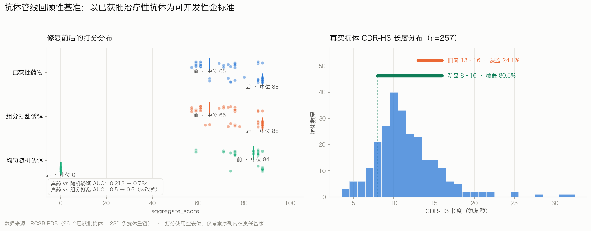

# 抗体设计管线回顾性基准验证

> 生成脚本：`scripts/make_benchmark_report.py`（数据来自 `run_antibody_benchmark.py` 的 before/after 两次运行）

## 方法

以 **26 个已获批治疗性抗体**为可开发性金标准，检验管线的过滤与打分是否会误杀真药。
另取 **231 条 PDB 抗体重链**建立长度与芳香族占比的真实分布，用于阈值标定。

关键前提：该打分器是**可开发性/责任基序过滤器**（`BASE_SCORE=80` 减惩罚），**不预测结合亲和力**。因此「能否按结合力召回真药」是错的问法；唯一科学成立的问法是「过滤器会不会拒绝已经上市的药」。

**数据溯源**：抗体名称与序列一律取自 RCSB PDB 的链描述字段，不使用任何记忆值。同一药物有多个结构时采用**多数表决**——这剔除了 `7PKL_2`（「trastuzumab Light Chain VHH fusion」，其可提取的 CDR-H3 属于融合的纳米抗体而非曲妥珠单抗）。CDR-H3 提取规则在 4 个已发表 Kabat 值上逐字符回测（`verify_extractor`）。

打分使用**空表位**，仅考察序列内在责任基序——26 个金标准抗体结合 26 个不同靶点，任何单一共享表位都是任意的。各队列处理条件完全一致。

## 发现的缺陷

### Bug-1　硬排除条件被静默降级

`generation_filter.py` 发出的 5 个旗标不存在于 `schemas.PENALTY_TABLE`，**其中包含全部 4 个硬排除条件**（`extra_Cys_in_CDRH3`、`cdrh3_length_out_of_allowed_range`、`noncanonical_amino_acid`、`nglyc_motif_in_CDRH3`）。
`scoring.score_candidate` 通过 `PENALTY_TABLE.get(flag, ("WARNING", 2, flag))` 解析旗标，未登记的键落入默认分支，硬排除被降级为 **-2 分警告**。

实测后果：4aa 序列 `NDDY` 被过滤器判 `accepted=False`，打分器却给出 **93.0 分且 `accepted=True`**。另有 14 条 `PENALTY_TABLE` 条目为死代码，从未被任何模块发出。

### Bug-2　硬失败信号在生产路径被丢弃

`api.py` 中 `ok, f, m = filter_cdrh3_design(...)` 之后 **`ok` 从未被使用**，过滤器的否决权从未进入 `score_and_rank_candidates` 的输出。

### 标定偏移　阈值在惩罚常态而非异常

| 阈值 | 原值 | 在真实抗体上的表现 | 新值 | 依据 |
|---|---|---|---|---|
| 偏好长度窗 | 13–16 | **仅覆盖 24.1%**（76% 真药被扣 12 分） | 8–16 | P10–P90，覆盖 80.5% |
| 允许长度窗 | 6–26 | 硬排除 nivolumab（4aa） | 4–32 | 实测最小/最大值 |
| 芳香族占比 | > 0.30 | **命中 45.9%**（真实中位数恰为 0.300） | > 0.45 | P90，命中 10.1% |
| 单一芳香族 | > 0.25 | 命中 27.2% | > 0.36 | P90，命中 9.7% |
| 单一氨基酸占比 | frac > 0.35 | 短序列假阳性（4aa 中一次重复即 50%） | 附加 count ≥ 4 | 误报 16.0% → 10.5% |

> `PENALTY_TABLE` 中 `high_aromatic_fraction` 的说明文字本就写着「> 45%」，而代码实现用的是 0.30——文档与实现原本就不一致。

另外发现**双闸门长度定义冲突**：`sequence_qc` 硬失败区间为 <8 或 >22，`generation_filter` 为 <6 或 >26，同一序列可在两个闸门得到相反判定。现已改为共享同一组常量，无法再漂移。

## 修复前后对照

| 指标 | 修复前 | 修复后 | |
|---|---|---|---|
| 已获批药物通过率 | 96.2% | 100.0% | ✅ |
| 已获批药物中位分 | 65.0 | 88.0 | ✅ |
| 随机诱饵中位分 | 84.0 | 0.0 | ✅ |
| **AUC（真药 vs 随机诱饵）** | **0.212** | **0.734** | ✅ |
| AUC（真药 vs 组分打乱） | 0.5 | 0.5 | — |
| 闸门冲突（filter vs scorer） | 36 | 0 | ✅ |
| PDB 抗体样本通过率 | 91.8% | 95.2% | ✅ |

**最重要的一行是 AUC vs 随机诱饵**：修复前为 **0.212**——意味着均匀随机序列有约 79% 的概率打败真实上市药物。原因是真实抗体 CDR 富含芳香族，而过滤器恰恰重罚芳香族，**打分方向与「真实抗体性」呈负相关**。修复后为 **0.734**，方向已被纠正。

被拒绝的已获批药物：修复前 `nivolumab`；修复后 **无**。



## 未解决的问题（如实记录）

### 1. 打分器对「真实抗体性」无判别力（AUC = 0.5）

真药与其**组分匹配打乱序列**的 AUC 修复前后均为 0.5，26 对中 21 对分数完全相同，其余仅差 ±2。
根因是打分完全由氨基酸**组成**决定（长度、芳香族占比、电荷计数），而打乱保留组成不变——因此打分器无法区分真实治疗性抗体与其乱序版本。

这是**架构层面的限制，不是可通过调参解决的缺陷**。要获得判别力需引入位置敏感的打分（如残基位置偏好、结构可及性、配对能量），属于后续工作。本次修复解决的是「打分方向错误」，而非「打分缺乏分辨率」。

### 2. `sequence_qc` 对真实抗体的整体判负率偏高（27.6%）

其各条硬失败规则单独看均在 P90 目标附近（`excessive_single_aa_*` 10.5%、`excessive_aromatic_fraction` 10.1%），但多条独立的 P90 规则**叠加**后，257 条真实抗体中有 71 条（27.6%）被判 fail。
这是「多少条独立 P90 规则应当合成一次硬失败」的设计问题，而非单条阈值的标定问题，因此本次**未作改动**，留待后续以联合分布重新设计。

### 3. 双闸门对 6 个已获批药物仍有分歧

长度定义已统一，残留分歧全部来自 `sequence_qc` 自有的芳香族/酪氨酸阈值（`nivolumab`、`infliximab`、`cetuximab`、`natalizumab`、`eculizumab`、`basiliximab`），其中 4 个与 Tyr 富集相关——而 Tyr 富集正是抗体互补位的标志性特征。与问题 2 同源。

## 真实抗体分布（标定依据）

样本量 n = 257（26 个已获批药物 + 231 条 PDB 抗体重链）

| 指标 | 最小 | P5 | P25 | 中位 | P75 | P95 | 最大 |
|---|---|---|---|---|---|---|---|
| CDR-H3 长度 | 4 | 6 | 9 | 11 | 13 | 18.2 | 32 |
| 芳香族占比 | 0.000 | 0.077 | 0.200 | 0.300 | 0.375 | 0.500 | 0.700 |

## 复现

```bash
python scripts/build_antibody_benchmark.py      # 联网，重建数据集
python scripts/run_antibody_benchmark.py --tag before
python scripts/run_antibody_benchmark.py --tag after
python scripts/make_benchmark_figure.py
python scripts/make_benchmark_report.py
python -m pytest tests/test_antibody_benchmark.py -q
```

回归测试锁定了本次全部修复：将 `schemas.py` / `api.py` / `generation_filter.py` / `sequence_qc.py` 回退到修复前状态时，20 个测试中有 7 个失败。
